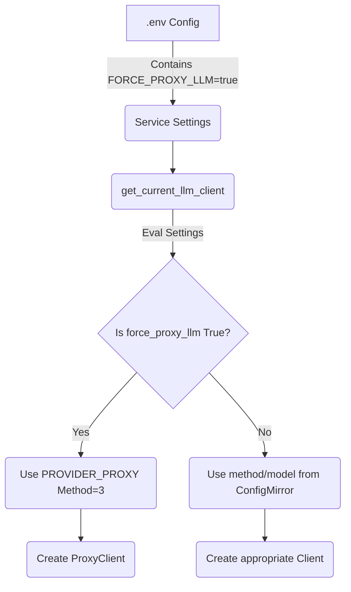

# Design: Force LLM Service Override

## Architecture
The system will inject an override mechanism at the point where `__main__.py` evaluates the local LLM configuration state. The `ConfigMirror` will remain as the generic state sync cache for all client configuration options (TTS, Log levels, UI settings, timeouts), maintaining consistency.

When an environment variable `force_proxy_llm=true` is set, `__main__.py:get_current_llm_client()` will completely ignore the `model_method` (e.g., 0, 1, 2) and `model_name` specified by `config_mirror` and will instead return `3` (the `PROVIDER_PROXY` token) and pull `.env` default configs for model and url.

### Data Flow



## Component Changes

### 1. `talker_service/src/talker_service/config.py`
Add environment variables to the Pydantic Settings model.
*   `force_proxy_llm: bool = False`  (This acts as the master switch to force proxy over whatever the game asks for)
*   The class already has `proxy_endpoint` and `proxy_api_key` properly bound to the `.env` model. We might want to add `proxy_model: str = ""` to allow specific remote model switching without passing fallback "default" to the proxy.

### 2. `talker_service/src/talker_service/llm/proxy_client.py` 
As we observed from the codebase search, `proxy_model` was partially missing natively. While `model` falls back to "default", we should ensure we explicitly populate `self.default_model` out of `kwargs` or settings if provided during construction or in the factory. Ensure API keys are properly sent via Bearer Header. (Based on code review, the `ProxyClient` already formats the Auth header exactly as required by the GitHub PAT OpenAI-compatible API).

### 3. `talker_service/src/talker_service/llm/factory.py`
In the proxy section (where `elif provider == PROVIDER_PROXY:`):
* Retrieve `proxy_model` from settings or `kwargs` and pass it down. Currently, it defaults to a local ENV fallback. Since we are using an enterprise PAT system (Github Copilots), we usually want to declare `gpt-4o` or similar as the target proxy model natively.

### 4. `talker_service/src/talker_service/__main__.py`
Modify `get_current_llm_client()`:
```python
def get_current_llm_client():
    from .handlers.config import config_mirror
    from .config import settings
    
    if settings.force_proxy_llm:
        logger.debug("Forcing LLM Provider to PROXY due to force_proxy_llm environment variable")
        # PROVIDER_PROXY maps to 3 in factory.py
        model_method = 3 
        # Optional: Grab explicit model from settings if desired
        model_name = getattr(settings, "proxy_model", None) 
    else:
        model_method = config_mirror.get("model_method", 0)
        model_name = config_mirror.get("model_name", "")

    return get_llm_client(
        provider=model_method,
        timeout=settings.llm_timeout,
        model=model_name if model_name else None,
    )
```

## Dependencies
*   Pydantic parsing of `.env` configurations.
*   The `.env` file for testing this specific implementation will need `FORCE_PROXY_LLM=true`

## Security and Privacy
*   Does not expose the server's `.env` configuration (such as the PAT) back to the Lua Game Client. Settings remain strictly scoped within the python service.
*   Does not leak local server structure.